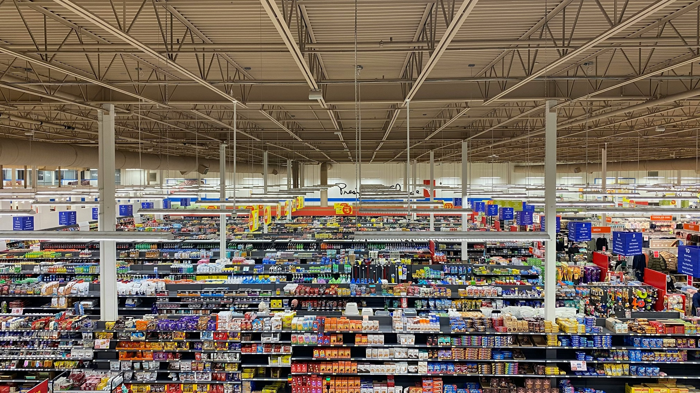
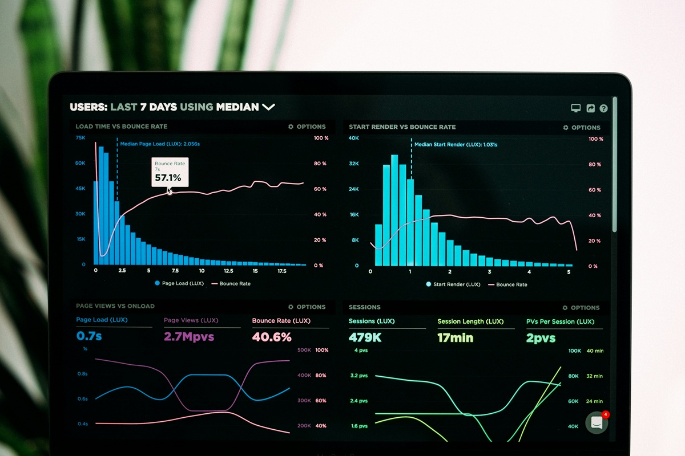

# 🏪 The Store Floor Has No AI
### Why Retail's Biggest Opportunity Lives at the Frontline



> *"It's no use going back to yesterday, because I was a different person then."*
> — Lewis Carroll, *Alice's Adventures in Wonderland*

[](https://www.linkedin.com/feed/update/urn:li:share:7443506489593520128/?skipRedirect=true)
[](LICENSE)

---

## 📌 Overview

While billions flow into retail AI at corporate headquarters, the store managers who actually face customers every morning have almost no AI tools. This repository explores why that's the biggest untapped opportunity in retail — and proposes a conceptual architecture for a **Store-Level AI Agent**.

**Key insight:** Generic AI gives generic answers. Store managers don't have generic problems.

---

## 🧠 The Problem

```
Corporate HQ:                  Store Floor:
---------------------          ---------------------
✅ Demand forecasting          ❌ No AI tools
✅ Supply chain AI             ❌ Spreadsheets
✅ Dynamic pricing             ❌ Generic ChatGPT
✅ Customer segmentation       ❌ Gut instinct
```

> **The intelligence sits at the top. The decisions happen at the bottom.**

Today's LLMs can say *"seasonal items drive Q4 traffic"* — but they can't tell a specific store manager:

- That **this store** serves a neighborhood 40% young families who over-index on organic snacks
- That **Tuesday evenings** show a sales drop because staffing doesn't match traffic
- Those **years of store data** reveal losses from misplaced displays nobody analyzed

---

## 🏗️ Proposed Architecture: Store-Level AI Agent
```
====================================================
            STORE-LEVEL AI AGENT
====================================================

📊 DATA LAYER (Store-Specific):
   * Sales history: 3-5 years, this store only
   * Inventory: real-time stock, shrinkage
   * Staffing: schedules, coverage, productivity
   * Local demographics: census, ZIP analysis
   * Traffic: foot traffic by hour/day
   * Competition: nearby stores, new openings
   * Weather: local forecasts > demand correlation
   * Customer: purchase clusters, loyalty data

🤖 AGENT LAYER:

   [1] Morning Briefing Agent
       "Here's what you need to know today"

   [2] Inventory Optimization Agent
       "Aisle 4 organic milk trending 30% above
        forecast -- restock before 2 PM"

   [3] Local Marketing Agent
       "Back-to-school: 2,100 school-age children
        in area. Feature lunch prep on endcap 3"

   [4] Q&A Agent (Natural Language)
       Manager: "Why did produce drop Tuesday?"
       Agent:   "Revenue -19%. Likely: staffing
                 gap 4-6 PM + competitor promo"

   [5] Anomaly Detection Agent
       Proactive alerts on unusual patterns

👥 USER LAYER:
   * Store Coach ......... strategic briefings
   * Department Lead ..... dept-specific insights
   * Team Lead ........... task-level guidance

🔒 GUARDRAILS:
   * Role-based data access
   * No individual customer PII
   * Sources cited for every answer
   * Human-in-the-loop: recommendations only
====================================================
```

## Visual Architecture
```mermaid
graph TD
    A[STORE-LEVEL AI AGENT] --> B[📊 Data Layer]
    A --> C[🤖 Agent Layer]
    A --> D[👥 User Layer]
    A --> E[🔒 Guardrails]
    
    B --> B1[Sales History: 3-5 years]
    B --> B2[Real-time Inventory]
    B --> B3[Local Demographics]
    B --> B4[Traffic Patterns]
    B --> B5[Competition Mapping]
    
    C --> C1[Morning Briefing Agent]
    C --> C2[Inventory Optimization Agent]
    C --> C3[Local Marketing Agent]
    C --> C4[Q&A Agent]
    C --> C5[Anomaly Detection Agent]
    
    D --> D1[Store Coach]
    D --> D2[Department Lead]
    D --> D3[Team Lead]
    
    E --> E1[Role-based Access]
    E --> E2[No Customer PII]
    E --> E3[Human-in-the-loop]


```

### Conceptual Tech Stack

| Component | Technology |
|-----------|-----------|
| LLM | GPT-4 / Claude / Llama 3 |
| Retrieval | RAG (Retrieval-Augmented Generation) |
| Data Layer | SQL Database + Vector Store |
| Agent Framework | LangChain / CrewAI / AutoGen |
| Embeddings | OpenAI / Cohere / Local models |
| Dashboard | Streamlit / Gradio |
| Deployment | Cloud (AWS/Azure) or Edge |

---

## 📊 Industry Data

| Metric | Finding | Source |
|--------|---------|--------|
| AI managed from corporate | 78% | McKinsey 2024 |
| Store-level AI adoption by 2027 | 40% of decisions | McKinsey 2024 |
| Customer satisfaction impact | +15-25% | Deloitte 2024 |
| Same-store sales growth | +8-12% | Deloitte 2024 |
| ROI timeline | 18-24 months | Gartner 2024 |
| Retail AI market by 2028 | \$31B+ globally | NRF/Statista |

---

## 🔮 The Competitive Advantage


> *Headquarters has the brain. The store floor needs the nerve endings.*

The competitive edge won't be:
- ❌ Delivery speed (everyone will have it)
- ❌ Automated shelves (table stakes)
- ❌ Better corporate algorithms (diminishing returns)

The winner will be:
- ✅ **The store where the customer feels known**
- ✅ Where AI understands **this neighborhood**
- ✅ Where team leads have intelligence **before the morning huddle**

### "The Store as Your Neighborhood Home."
A place that doesn't just sell products but genuinely understands and cares for its community.

---

## 🔄 Workforce Transformation

This isn't just a technology story. It reshapes retail hiring:

**New skill profile for store managers:**
- Operations management (traditional)
- Data literacy (interpret AI insights)
- AI collaboration (ask the right questions)
- Community understanding (local market knowledge)

**Emerging roles:**
- 🆕 Store Intelligence Lead
- 🆕 Retail AI Coach
- 🆕 Local Market Analyst

**Retail AI Academies:**
- Internal training for store-level managers
- Practitioner-educators at the intersection of AI and retail

---

## 📚 Sources

1. McKinsey & Company — [The State of AI in Retail, 2024](https://www.mckinsey.com/industries/retail)
2. Deloitte — [Retail AI Impact Study, 2024](https://www2.deloitte.com/insights)
3. National Retail Federation — [AI in Retail Operations, 2024](https://nrf.com/research)
4. Harvard Business Review — [Why Most AI Initiatives in Retail Fail to Scale, 2023](https://hbr.org)
5. Gartner — [Predicts 2025: AI in Retail, 2024](https://www.gartner.com)
6. MIT Sloan Management Review — [The Frontline AI Gap in Retail, 2024](https://sloanreview.mit.edu)

---

## 👤 Author

**Slav Pechenevskyi**
AI Product Leader | SaaS Implementation Consultant | GenAI & LLM Evaluation

[](https://www.linkedin.com/in/svyatsolution/)

*All observations based on publicly available industry research and general professional experience. No proprietary or confidential information from any specific employer is referenced.*

---

## 📄 License

This project is licensed under the MIT License — see the [LICENSE](LICENSE) file for details.

---

## 🤝 Contributing

Have you experienced store-level AI in retail? 
I'd love to hear your perspective.

- Open an [Issue](../../issues) to share ideas
- Submit a [Pull Request](../../pulls) with improvements
- Connect on [LinkedIn](https://www.linkedin.com/in/svyatsolution/) to discuss

---

*Built with curiosity, mathematics, and 15+ years of enterprise data experience.*
